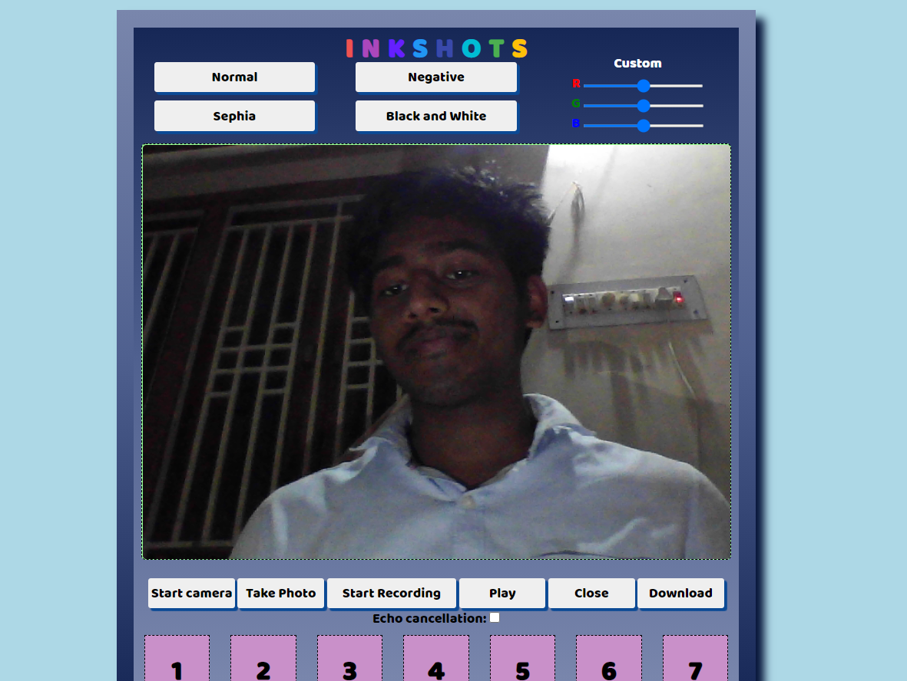
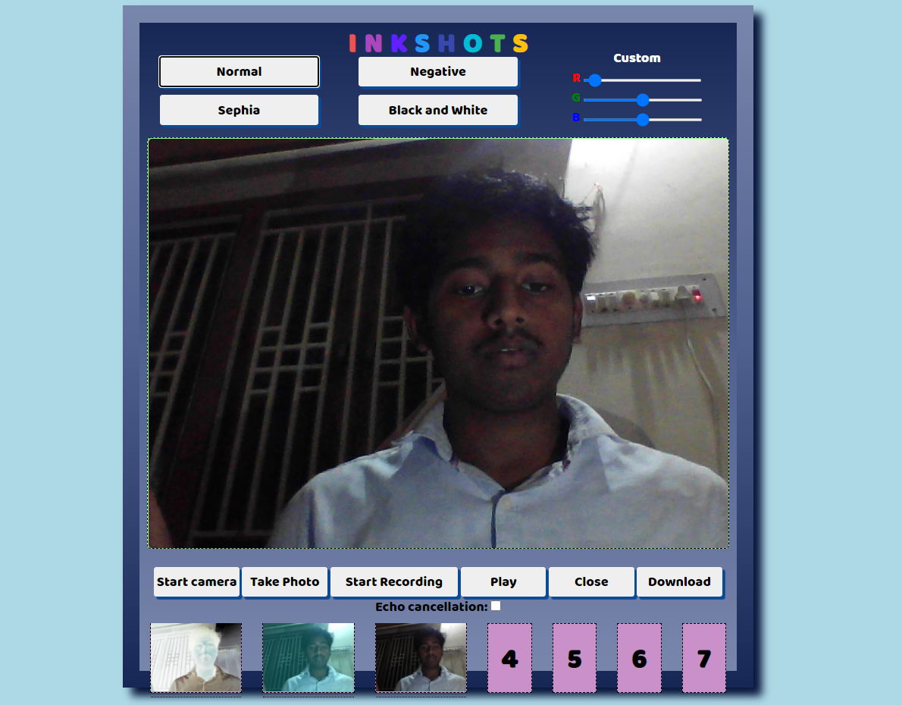
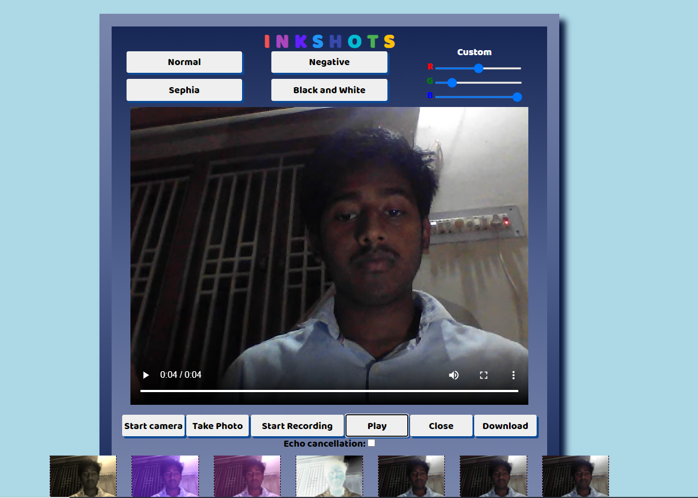
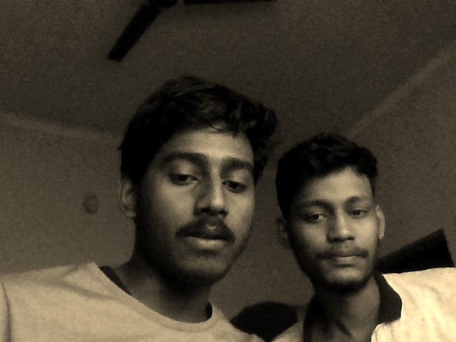

This is a webApp similar to photo booth app in masos.

you can capture image using camera.
you can also use different fileter to beautify the image and save t your local machine.

you can also capture video + audio using camera also play and if wish can download it to your local machine.

 

<h3 style="color:blue">screenshoot of InkShot app</h3>
 

 

 

<h3 style="color:blue">screenshoot of InkShot app captured image</h3>
 

 

 

